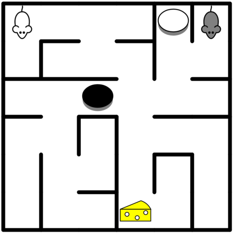

# Mazerace

A two-player in-browser maze game implemented in Clojure/ClojureScript. You can try out the game [here](https://mazerace.herokuapp.com).

The game itself is a remake of a Windows game from the nineties that somehow ended up on my harddisk and has since been long lost. If you happen to know the original author of the game be sure to let me know so I can credit the author.

## Screenshot

# Running

To run locally, build the code by running 

`lein uberjar` 

Then start the resulting package using 

`java -jar target/mazerace.jar`.

# Development

To run the whole thing during development, first clean any artifacts left from building a release package by running `lein clean`.

Start the backend by running `lein run`. Start the clojurescript compiler by running `lein with-profile dev cljsbuild auto`.

# Source organization

The game is composed of the server-side backend in `src` folder and the frontend code in `src-ui`.

The backend embeds a [HTTP-Kit](/http-kit/http-kit) web server and uses core.async to decouple the core game code from websocket handling.

The frontend uses [Reagent](/reagent-project/reagent) for rendering the game as combination of html and svg.
